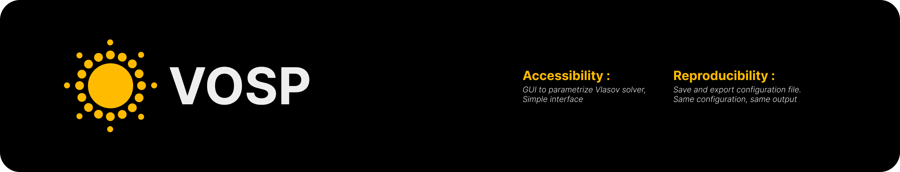

# VOSP
VOSP stands for (Vlasov Open Source Project).
It takes benefit of operator splitting to create a powerful, polyvalent and easy to use Vlasov solver.

VOSP can handle multiple species with different types of collisions. And is currently suited for simulating complex chemistry inside a vlasov simulation.